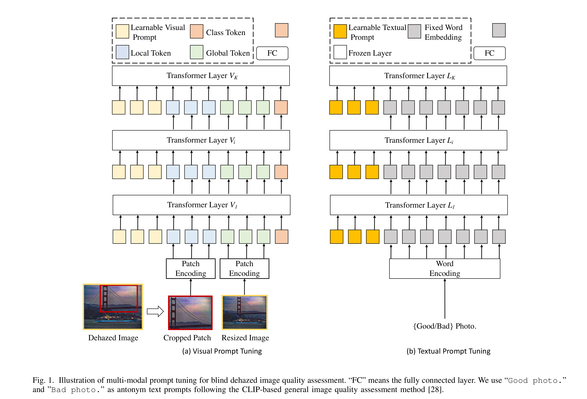

# CLIP-DQA: Blindly Evaluating Dehazed Images from Global and Local Perspectives Using CLIP

## Introduction
Blind dehazed image quality assessment (BDQA), which aims to accurately predict the visual quality of dehazed images without any reference information, is essential for the evaluation, comparison, and optimization of image dehazing algorithms. Existing learning-based BDQA methods have achieved remarkable success, while the small scale of DQA datasets limits their performance. To address this issue, in this paper, we propose to adapt Contrastive Language-Image Pre-Training (CLIP), pre-trained on large-scale image-text pairs, to the BDQA task. Specifically, inspired by the fact that the human visual system understands images based on hierarchical features, we take global and local information of the dehazed image as the input of CLIP. To accurately map the input hierarchical information of dehazed images into the quality score, we tune both the vision branch and language branch of CLIP with prompt learning. Experimental results on two authentic DQA datasets demonstrate that our proposed approach, named CLIP-DQA, achieves more accurate quality predictions over existing BDQA methods. 



## Train and Test
```
python train_test_CLIPDQA.py --dataset DHD --model CLIP-DQA
```
check the results in the folder `./log`.


## Citation
Please cite the following paper if you use this repository in your research.
```
@inproceedings{zeng2025clip,
  title={Clip-dqa: Blindly evaluating dehazed images from global and local perspectives using clip},
  author={Zeng, Yirui and Fu, Jun and Amirpour, Hadi and Wang, Huasheng and Yue, Guanghui and Liu, Hantao and Chen, Ying and Zhou, Wei},
  booktitle={2025 IEEE International Symposium on Circuits and Systems (ISCAS)},
  pages={1--5},
  year={2025},
  organization={IEEE}
}
```
